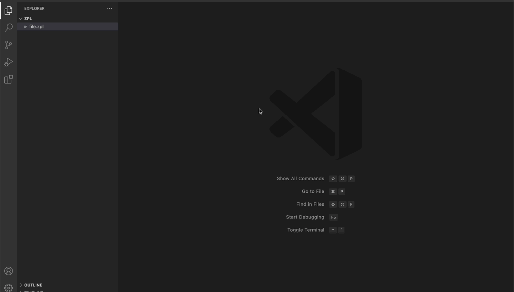

# vscode-zpl-offline-viewer

I like to see if can build an offline viewer based on kamilturek`s extension with a js-zpl-library i wrote long before. (Can only render images in Zpls B64 or Z64 format)
Not ready yet.

## Usage

## Changelog

See [CHANGELOG.md](CHANGELOG.md).

## License

See [LICENSE](LICENSE).

## Contribution

Please create a GitHub issue for any feedback, bugs, requests or issues.
PRs are also welcome.
